# Step 3: Graphical Notation and Visualization - Summary

## Overview

Step 3 implements comprehensive graphical notation and visualization capabilities for the Funding DSL. This module transforms abstract funding configurations into intuitive visual representations, making complex funding structures easy to understand, analyze, and present.

## Key Components

### 1. Core Visualization Engine (`funding_visualizer.py`)

The `FundingVisualizer` class provides the foundation for all visual representations:

#### Mermaid Diagram Generation
- **Flowcharts**: Show funding flow from platforms to beneficiaries
- **Pie Charts**: Display platform distribution and diversity
- **Timelines**: Visualize funding goal progression over time
- **Class Diagrams**: Technical structure overview for developers

#### Text-Based Visualizations
- **ASCII Art**: Terminal-friendly overview with box drawing characters
- **Funding Matrix**: Relationship mapping between beneficiaries and sources
- **Analysis Reports**: Structured data summaries

### 2. Interactive Diagram Generator (`interactive_diagrams.py`)

The `InteractiveDiagramGenerator` class provides advanced analysis and interactive features:

#### Configuration Analysis
- Platform diversity assessment
- Goal tracking and progress calculation
- Tier analysis and pricing insights
- Funding source activity monitoring

#### Smart Recommendations
- Platform diversification suggestions
- Funding strategy improvements
- Goal setting recommendations
- GitHub integration advice

## Supported Visualization Types

### 📊 Mermaid Diagrams (Web-Ready)

| Type | Purpose | Features |
|------|---------|----------|
| **Flowchart** | Funding flow visualization | Platform-to-beneficiary relationships, tiers, goals |
| **Pie Chart** | Platform distribution | Source count by platform, diversity analysis |
| **Timeline** | Goal progression | Completed vs. ongoing goals, deadlines |
| **Class Diagram** | Technical structure | UML-style metamodel representation |

### 🎨 Text-Based Visuals (Terminal-Friendly)

| Type | Purpose | Features |
|------|---------|----------|
| **ASCII Art** | Quick overview | Box-drawn summary with emojis |
| **Matrix View** | Relationship mapping | Beneficiary-platform connections |
| **Analysis Summary** | Detailed insights | Metrics, recommendations, statistics |

## Example Outputs

### ASCII Art Overview
```
╔════════════════════════════════════════════════════════════╗
║                       octo-package                         ║
╠════════════════════════════════════════════════════════════╣
║ A minimal funding configuration example                    ║
║                                                            ║
║ 👥 Beneficiaries: 2                                       ║
║    • Octocat (@octocat)                                   ║
║    • Surftocat (@surftocat)                               ║
║                                                            ║
║ 💰 Active Funding Sources: 6                              ║
║    • Github Sponsors: 2 sources                           ║
║    • Patreon: 1 source                                    ║
║    • Custom: 3 sources                                    ║
╚════════════════════════════════════════════════════════════╝
```

### Mermaid Flowchart

```mermaid
flowchart TD
    PROJECT["octo-package"]
    
    BEN1["Octocat<br/>🧑‍💻 octocat"]
    PROJECT --> BEN1
    BEN2["Surftocat<br/>🧑‍💻 surftocat"]
    PROJECT --> BEN2
    
    PLAT_GITHUB_SPONSORS["💖 GitHub Sponsors<br/>octocat, surftocat"]
    PLAT_PATREON["🎨 Patreon<br/>octocat"]
    PLAT_CUSTOM["🔗 Custom<br/>PayPal, Tidelift, Website"]
    
    PLAT_GITHUB_SPONSORS --> BEN1
    PLAT_GITHUB_SPONSORS --> BEN2
    PLAT_PATREON --> BEN1
    PLAT_PATREON --> BEN2
    PLAT_CUSTOM --> BEN1
    PLAT_CUSTOM --> BEN2
```


## API Reference

### Basic Usage

```python
from step3 import FundingVisualizer, visualize_funding_config

# Create visualizer
visualizer = FundingVisualizer(config)

# Generate specific diagram types
flowchart = visualizer.generate_mermaid_flowchart()
pie_chart = visualizer.generate_mermaid_pie_chart()
timeline = visualizer.generate_mermaid_timeline()
ascii_art = visualizer.generate_ascii_overview()

# Convenience function
flowchart = visualize_funding_config(config, 'flowchart')
```

### Interactive Analysis

```python
from step3.interactive_diagrams import InteractiveDiagramGenerator

# Create interactive generator
generator = InteractiveDiagramGenerator(config)

# Analyze configuration
analysis = generator.analyze_configuration()
print(f"Platform diversity: {len(analysis['platform_distribution'])} platforms")
print(f"Overall progress: {analysis['goal_analysis']['overall_progress']:.1f}%")

# Get recommendations
summary = display_configuration_summary(config)
print(summary)
```

### Batch Generation

```python
from step3.interactive_diagrams import create_funding_diagrams

# Generate all diagrams at once
diagrams = create_funding_diagrams(config)
# Returns: {'funding_flow': '...', 'platform_distribution': '...', ...}
```

## Integration Capabilities

### 📝 Documentation Integration

```markdown

```mermaid
flowchart TD
    PROJECT["My Project"]
    GITHUB["💖 GitHub Sponsors"]
    PATREON["🎨 Patreon"]
    GITHUB --> PROJECT
    PATREON --> PROJECT
```

<!-- Embed in README.md -->


### 🔧 Development Workflow

```python
# In CI/CD pipeline
from step3 import visualize_funding_config

# Generate documentation diagrams
flowchart = visualize_funding_config(config, 'flowchart')
with open('docs/funding-flow.mmd', 'w') as f:
    f.write(flowchart)

# Generate ASCII summary for terminal output
ascii_summary = visualize_funding_config(config, 'ascii')
print(ascii_summary)
```

### 📊 Analysis and Reporting

```python
from step3.interactive_diagrams import InteractiveDiagramGenerator

generator = InteractiveDiagramGenerator(config)
analysis = generator.analyze_configuration()

# Platform diversity check
if len(analysis['platform_distribution']) < 3:
    print("⚠️ Consider diversifying funding platforms")

# Goal progress tracking
if analysis['goal_analysis']:
    progress = analysis['goal_analysis']['overall_progress']
    print(f"📈 Overall funding progress: {progress:.1f}%")
```

## Design Principles

### 1. **Multi-Modal Visualization**
- Mermaid diagrams for web/documentation
- ASCII art for terminal environments
- Structured data for programmatic analysis

### 2. **Progressive Disclosure**
- Simple overviews for quick understanding
- Detailed diagrams for comprehensive analysis
- Interactive features for exploration

### 3. **Platform Integration**
- GitHub-compatible Mermaid syntax
- Terminal-friendly ASCII output
- Web-embeddable diagram formats

### 4. **Accessibility**
- Emoji-enhanced visual cues
- Clear hierarchical structure
- Multiple representation formats

## Technical Implementation

### Dependencies
- **Built-in Python modules**: No external dependencies for core functionality
- **Mermaid compatibility**: Standard Mermaid syntax for web integration
- **Unicode support**: Box drawing characters and emojis

### Performance Characteristics
- **Fast generation**: Optimized for real-time use
- **Memory efficient**: Minimal memory footprint
- **Scalable**: Handles large configurations gracefully

### Error Handling
- **Graceful degradation**: Fallback to simpler formats if needed
- **Validation**: Input validation with helpful error messages
- **Robustness**: Handles missing or incomplete data

## Use Cases and Benefits

### 1. **Project Documentation**
- Embed funding flow diagrams in README files
- Generate visual funding guides for contributors
- Create professional presentation materials

### 2. **Funding Strategy Analysis**
- Assess platform diversity and risk
- Track goal progress visually
- Identify optimization opportunities

### 3. **Stakeholder Communication**
- Present funding structure to sponsors
- Communicate goals and progress
- Demonstrate transparency and professionalism

### 4. **Development Integration**
- Include in CI/CD pipelines
- Generate reports automatically
- Monitor funding health over time

## Future Enhancements

### Potential Extensions
1. **Interactive Web Components**: HTML/JavaScript widgets
2. **Advanced Analytics**: Trend analysis and forecasting
3. **Custom Themes**: Branded diagram styling
4. **Export Formats**: SVG, PNG, PDF generation
5. **Real-time Updates**: Live data integration

### Integration Opportunities
1. **GitHub Apps**: Direct repository integration
2. **VS Code Extension**: Editor-embedded visualizations
3. **Web Dashboard**: Online funding analytics
4. **Mobile Apps**: Funding status on-the-go

## Testing and Quality Assurance

### Comprehensive Test Coverage
- ✅ ASCII art generation and formatting
- ✅ Mermaid diagram syntax validation
- ✅ Interactive analysis accuracy
- ✅ Configuration summary completeness
- ✅ Error handling and edge cases

### Quality Metrics
- **Diagram Accuracy**: Visual representations match data
- **Format Compliance**: Valid Mermaid syntax
- **Performance**: Sub-second generation times
- **Accessibility**: Clear visual hierarchy

## Conclusion

Step 3 completes the visual aspect of our Funding DSL, providing:

1. **Rich Visual Representations** - Multiple diagram types for different use cases
2. **Interactive Analysis** - Smart insights and recommendations
3. **Professional Integration** - Web-ready and documentation-friendly formats
4. **Developer-Friendly APIs** - Simple and powerful programmatic access

The visualization capabilities transform our DSL from a text-based configuration tool into a comprehensive funding management platform with visual intelligence. Users can now not only define and export funding configurations but also visualize, analyze, and optimize their funding strategies through intuitive graphical representations.

This positions our Funding DSL as a complete solution for modern open source funding management, bridging the gap between technical configuration and visual communication.

---

*Generated as part of the Funding DSL Step 3 implementation* 